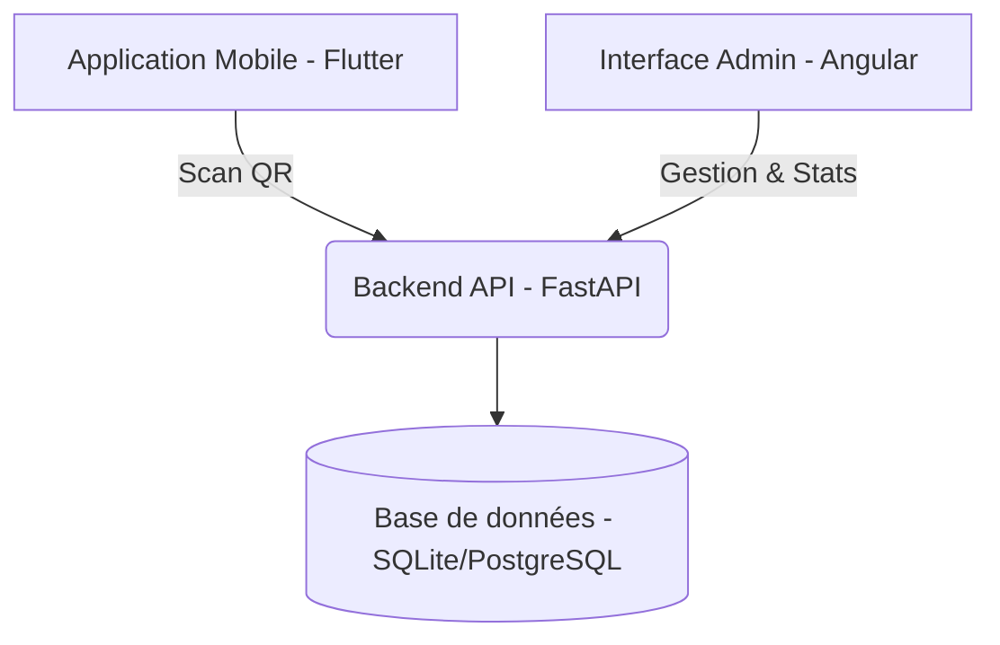

# ST2I - Système de Gestion de Pointage et de Présences

 *<!-- Note: Remplacez par le lien réel de votre logo si disponible -->*

**ST2I** est une solution complète de gestion du temps et des présences, conçue pour simplifier le suivi des employés et des étudiants via une technologie de scan QR sécurisée.

## 🚀 Architecture du Projet

Le projet est structuré comme un monorepo comprenant trois composants principaux :



### 1. 📱 Application Mobile (Flutter)
Destinée aux utilisateurs finaux pour :
- **Identification sécurisée** via QR Code dynamique.
- **Consultation de l'historique** personnel de présence.
- **Réception de notifications** en temps réel.

### 2. 💻 Interface Administration (Angular)
Une plateforme moderne pour les gestionnaires :
- **Tableau de bord interactif** avec indicateurs clés (KPIs) et graphiques Chart.js.
- **Gestion des utilisateurs** (CRUD complet, rôles, statuts).
- **Suivi des présences** en temps réel et alertes sur les retards/absences.
- **Génération de rapports** et export (PDF/Excel).
- **Configuration système** et paramètres personnalisables.

### 3. ⚙️ Backend API (FastAPI / Python)
Le cœur du système :
- **Architecture RESTful** performante et sécurisée.
- **Authentification JWT** et gestion des rôles (RBAC).
- **Tâches automatisées** (APScheduler) pour le nettoyage et les notifications.
- **Génération de QR Codes sécurisés** avec rotation automatique.

## 🛠️ Stack Technique

- **Frontend Admin:** Angular 17/18, Angular Material, Chart.js, SCSS.
- **Mobile Multi-plateforme:** Flutter, Dart, Provider/Riverpod.
- **Backend:** Python 3.10+, FastAPI, SQLAlchemy, Uvicorn.
- **Base de données:** SQLite (Développement), supporté par PostgreSQL.

## 📦 Installation et Lancement

### Prérequis
- Python 3.10+
- Node.js & npm (pour l'admin)
- Flutter SDK (pour le mobile)

### 1. Backend
```bash
cd ST2I
$env:PYTHONPATH="."
python app/main.py
```

### 2. Admin Web
```bash
cd st2i-admin
npm install
npm start
```

### 3. Application Mobile
```bash
cd st2i_mobile
flutter pub get
flutter run
```

---
© 2026 ST2I - Tous droits réservés.
